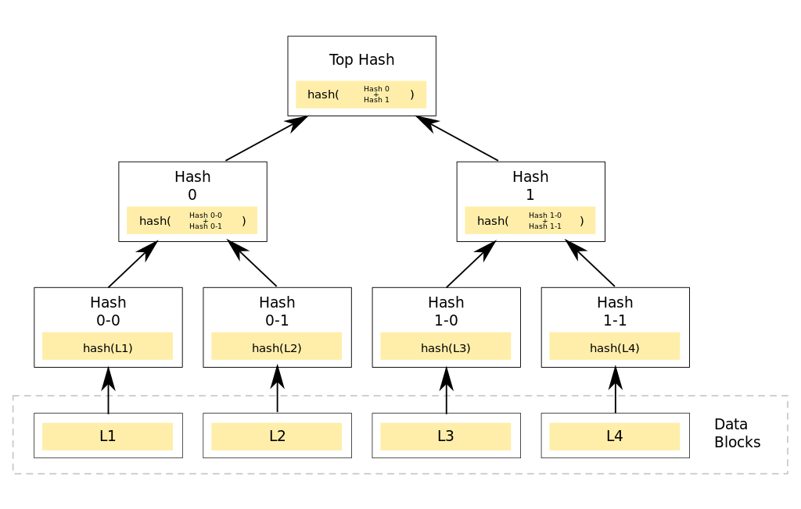

# Hash pointer

A *hash pointer* consists of 2 informations:

- Address where some info is stored
- Hash of that info

Hash pointers can be used in every non-cyclical data structures that uses pointers.

# Blockchain

A *blockchain* is a list of linked records, called blocks. Each block contains a cryptographic hash of the previous block.

## Use cases

A blockchain can be used as a tamper evident log. For example, in Bitcoin, a blockchain logs all the transactions (organized in blocks) approved by the network.

# Merkle tree

A *Merkle tree* is a tamper evident binary tree structure.
The following diagram explains how to build a Merkle tree starting from a known amount of data blocks:

A Merkle tree needs to show *log(N)* items to provide proof of membership for a given data block. The time complexity of this operation is *log(N)* too.

## Use cases

Merkle trees can be used to give informations about a sequence of transactions without needing the data of all the transactions in the sequence, while still preventing attackers to easily tamper that data.
