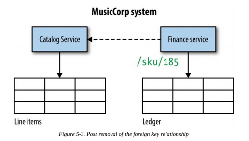
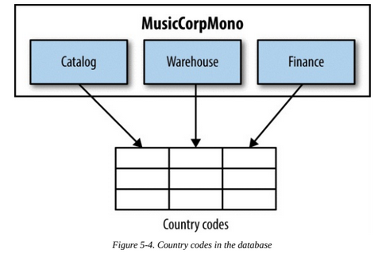
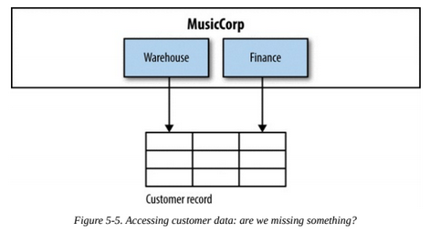
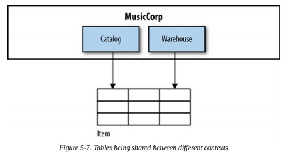

# Splitting the monolith

Why would you want to split a monolith?

- There are lots of changes coming to a part of the monolith, splitting that part into a service will make you roll out those changes faster.
- Separate teams work on separate parts of the monolith.
- A part of the monolith requires increased security measures not needed by the rest of the system.
- A part of the monolith can be improved by switching technology.

How do we go about decomposing monolithic applications without having to embark on a big-bang rewrite?

## Seams

We want our services to be highly cohesive and loosely coupled. The problem with the monolith is that all too often it is the opposite of both.

A seam is a portion of the code that can be treated in isolation and worked on without impacting the rest of the codebase. Bounded contexts are good seams.

So when splitting, the first step is to identify seams in our system and then gradually move the code of these seams into different packages. Tests are really useful to make sure you're not introducing bugs with this packaging. This process will also help identify seams that you did not think of: they will come out when you are left with some code that you don't know in which package to place.

The splitting should start from the seam that is least depended on.

## Databases

We have to find seams in databases too, but this is a difficult task.

After having packaged your application code by seams, you should do the same for the code accessing the database (usually the code in the so called *repository layer*).

### Foreign keys

Some tables may have foreign keys linking them to other tables. A common solution for this problem is to remove the table relationship and make the service accessing that table call the API of the service handling the other table.

### Shared static data

Let's suppose we have different services accessing a table filled with static data.

There are several solutions:

1. Duplicate tables in each db, but this can cause consistency issues.
2. Treat static data as code/configuration files in each service. This can cause consistency issues too, but they would be far easier to solve.
3. Create a microservice to handle the static data. This is overkill in most situations, but it can be justified if the static data has high complexity.

### Shared mutable data

Let's suppose we have different services accessing a table filled with mutable data.

Usually this means we need a *Customer* microservice to handle that data. This service can then be called by *Warehouse* and *Finance*.

### Shared tables

Let's suppose we have different services accessing a table which aggregates different informations in the same record (catalog entry and stock level).

The answer here is to split the table in two, creating a
stock levels table for the *Warehouse* and a catalog entry table for the *Catalog*.

### Staging the break

The best way to commit the database changes would be to keep the services together and split the schemas. The db split will increase the number of db calls and make you lose transactional integrity. Having the same application will enable you to deal more easily with these problems. Then, when you are satisfied with the new db, you can commit the changes.

### Transactional Boundaries

Transactions allow us to say that operations either all happen
together, or none of them happen.

Transactions are typically used in databases, but they can be supported but other systems such as message brokers.

Splitting schemas will cause the loss of transactional integrity in our system. There are several solutions to this problem:

- A **try again later** mechanism, but this alone is not sufficient since it assumes that eventually a failed request will be successful. This is a form of **eventual consistency**: rather than using a transactional boundary to ensure that the system is in a consistent state when the transaction completes, instead we accept that the system will get itself into a consistent state at some point in the future.
- **Compensating transactions** can be used to undo the committed transactions preceding a failed operation. But what if a compensating transaction fails? We would need other mechanism such as automated jobs or human administration. Also, this mechanism becomes more difficult to manage as the number of operations increases in transactions.
- **Distributed transactions** are transactions done across different process or network boundaries. They are orchestrated by a *transaction manager*. The most common algorithm handling short-lived distributed transactions is **two-phase commit**. With a two-phase commit, first comes the voting phase: each participant in the distributed transaction tells the transaction manager whether it thinks its local transaction can be completed. If the transaction manager gets a yes vote from everyone, then it tells them all to go ahead and perform their commits. A single no vote is enough for the transaction manager to send out a rollback to all parties. Distributed transactions make scaling systems much more difficult, since the transaction manager is a single point of failure and waiting for response while locking resources can cause outages. Also, there is no guarantee that the transactions are actually committed when the clients approve them.

Each of these solutions adds complexity. Before implementing business operations happening in a transaction, ask yourself: can they happen in different, local transactions, and rely on the concept of eventual consistency? These systems are much easier to build and scale.

If you do encounter state that really needs to be kept consistent, try to avoid splitting it. If you really need to split it, try moving from a purely technical view of the process (e.g., a database transaction) and actually create a concrete concept to represent the transaction. This gives you a hook on which to run other operations like compensating transactions, and a way to monitor and manage these more complex concepts in your system.

## Reporting

When splitting data, we'll come across the problem of splitting reporting data too.

### The Reporting Database

In monolithic systems, aggregating data for reporting is easy. Usually reporting is implemented like this:

Benefits:

- All data is one place so it's easy to query it.

Downsides:

- The db schema is a shared API between the monolith and the reporting service.
- Cannot optimize schema structure for both use cases. Either the db is optimized for the monolith or the reporting.
- Cannot use different technology that could be more efficient for reporting.

There are several alternatives to this approach when our data is distributed across different services.

### Data Retrieval via Service Calls

A very simple approach: call service APIs and aggregate the results for reporting.

Benefits:

- Easy to implement and works well for small volumes of data (e.g. #orders placed in the last 15 minutes).

Downsides:

- Breaks down when trying to do reporting with large volumes of data (e.g. customer behaviour of last 24 months).
- Reporting systems usually need to integrate with third-party tools over SQL-like interfaces, this approach would require extra work.
- The API may not have been designed for reporting, leading to an inefficient reporting system and general slowdown. Caching can help, but reporting data is usually historic so there would be a lot of expensive cache misses. Adding reporting-specific APIs can help.

### Data Pumps

# WIP