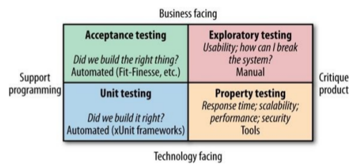
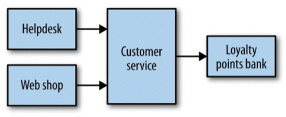

# Testing

Distributed systems add complexity in automated tests too.

## Types of Tests

Tests can be categorized by the following diagram:

In microservices, the amount of manual tests should be kept at a minimum in order to reduce test times. Also, since there are no significant difference in manual testing, we will examine how automated testing changes from monolithic systems to microservices systems.

## Test scope

The Test Pyramid is a model proposed by Mike Cohn to associate the ideal amount of tests to each test scope.

Terms like *service* and *unit* in this context are ambiguous and we will refer to the *UI* layer as *end-to-end* tests.

To better explain what each layer represents, we introduce the following communication scenario:

### Unit Tests

They typically test a single function or method call in isolation (i.e. without starting services or using external resources such as network connectivity).

Done right, they can be very fast. You could run a lot of them in less than a minute.

These are *technology-facing* tests that will help us catch the most bugs and guide us through code restructuring thanks to their fast feedback and reliability.

### Service Tests

They are designed to bypass the user interface and test services  directly.

In monolithic systems, a group of classes that provide a certain service to users can be tested together.

In microservices, we need to isolate the service we want to test so that we are able to quickly find the root cause of a bug. To achieve this isolation, we need to stub out other services interacting with the one under test.

# WIP