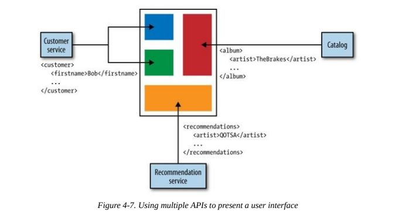
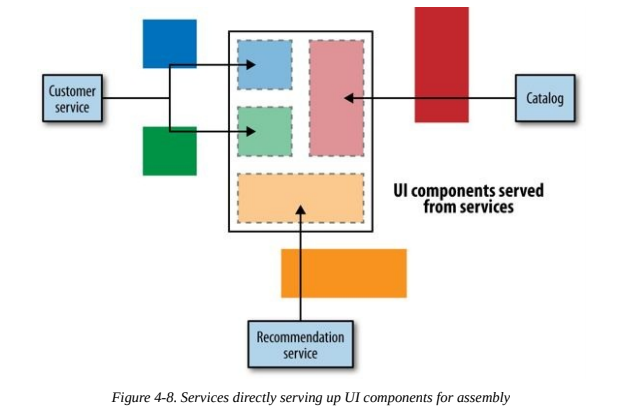
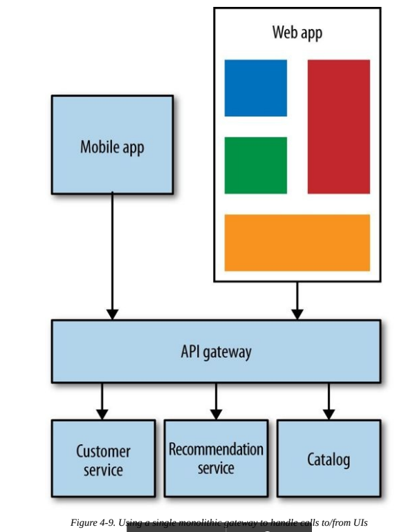
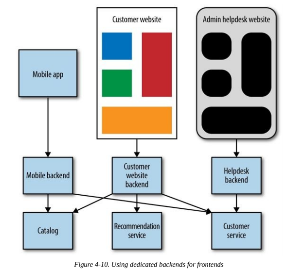

# Integration

Desirable properties of communication between microservices:

- Avoid breaking changes as much as possible.
- Technology agnostic APIs.
- Make it easy to consume APIs.
- Hidden internal implementation details.

## Shared database

The most common form of integration.

Has the following issues:

- Internal representations are not private, causing high coupling.
- Logic to modify some kind of data is present in different services, causing loss of cohesion.
- Every kind of data must be stored using the same DBMS technology.

These issues would eliminate the benefits of using microservices, so shared databases are to avoid.

## Synchronous vs Asynchronous

**Synchronous communication** starts with a blocking call to the server that resolves once the operation completes. It's easy to debug but lacks capabilities to effectively handle long-running processes.

**Asynchronous communication** does not wait for the server to respond. In theory, a client may even not need to know if the server completed the operation. It's not easy to debug but can effectively handle long-running processes.

These two different modes of communication can enable two different styles of collaboration:

- **Request/response:** natural fit to synchronous communication, can handle asynchronous communication too using callbacks.
- **Event-based:** natural fit to asynchronous communication. It's more flexible since a client just issues an event, allowing for more services to listen on that event later on, without modifying the client's code.

## Orchestration vs Choreography

**Orchestration** means having an orchestrator service that instructs other services on what to do and organizes the whole flow. This provides a clear view of the whole flow but can cause coupling if the orchestrator becomes a “god” microservice.

**Choreography** means that services can issue or listen to events. This approach keeps services decoupled but can make it hard to understand the whole flow.

## Remote procedure calls

Remote procedure call refers to the technique of making a local call and having it execute on a remote service somewhere.

RPC fit well with the request/response collaboration style.

The selling point of RPC is ease of use: it's really practical to make a remote call look like a local call.

However, RPC has issues too:

- Usually it causes technology coupling between client and server.
- Local calls must not be confused with remote calls, because of latency and unreliability.
- Brittleness, because server signatures and interfaces need to match exactly the ones in the client.

Compared to database integration, RPC is certainly an improvement when we think about options for request/response collaboration.

## REST

REpresentational State Transfer (REST) is an architectural style inspired by the Web. The most important concept is the one of resource, which can be requested in different representations. This favours decoupling between internal and external representations.

There are many different styles of REST, compared in the [Richardson Maturity Model](https://martinfowler.com/articles/richardsonMaturityModel.html).

Usually REST is implemented over HTTP because HTTP provides parts of the REST specification, such as verbs. Also, there are lots of tools supporting REST with HTTP.

### HATEOAS

Another principle introduced in REST that can help us avoid the coupling between client and server is the concept of **hypermedia as the engine of application state** (often abbreviated as HATEOAS). One of the downsides is that the navigation of controls can be quite chatty, as the client needs to follow links to find the operation it wants to perform. Ultimately, this is a trade-off.

### Serialization format

REST provides flexibility over the serialization format of the data. The most popular choices are JSON and XML.
XML has built-in support for hypermedia while there are standards to provide hypermedia data with JSON.

### Downsides to REST Over HTTP

- Not easy to generate stubs for REST over HTTP services as it would be with RPC.
- Some web servers do not *fully* support all the HTTP verbs.
- Performance is penalized because of hypermedia data and HTTP overhead.
- HTTP is not suited for frequently exchanging small volumes of data, WebSockets or protocol buffers are more suitable for this kind of communication.

Despite these disadvantages, REST over HTTP is a sensible default choice for service-to-service interactions.

## Implementing Asynchronous Event-Based Collaboration

To implement asynchronous event-based collaboration we need to consider:

- A way for our microservices to emit events.
- A way for our consumers to find out those events have happened.

Traditionally, **message brokers** like RabbitMQ can handle both problems, while also being able to scale and have resiliency.

But note that this kind of collaboration comes with a system complexity increase (e.g. if you're not careful, you could have [catastrophic failovers](https://martinfowler.com/bliki/CatastrophicFailover.html) as intended by Martin Fowler).

**Reactive extensions** can help you a lot when handling lots of calls to downstream services. They are a popular choice in distributed systems.

## DRY in Microservices

Following the DRY principle can cause coupling between microservices. As a general rule, DRY is to be followed only inside service boundaries. Across different services, code duplication is a smaller problem than coupling. An exception to this rule can be model-agnostic code such as logging, which can be safely shared between microservices.

### Client libraries

Client libraries can cause coupling between services and clients. To limit this danger, it's best if different developer teams develop the server API and the client library: this way there should be no "logic leaks" from the server into the client.
It's also important to give clients control on when to upgrade their client libraries, to avoid coupling in deploys.

## Access by Reference

Sometimes it may happen to pass around outdated information: we request a *Customer* and then we use that customer in another request, but in the meanwhile it has changed.
In order to retrieve the current state, such requests must include an ID of the involved resources. But this approach has downsides too:

- It may cause the *Customers* service to be accessed too much.
- It causes overhead in requests.

This is a tradeoff to consider. The point is: be aware of the freshness of data passed between microservices.

## Service versioning

The following points can help you have a good service versioning in your system:

- Defer breaking changes as long as possible (e.g. by using the *Tolerant reader* pattern).
- Robustness principle: “*Be conservative in what you do, be liberal in what you accept from others*”.
- Catch breaking changes early, tests help a lot here.
- Use semantic versioning.
- Have coexisting service versions to gradually adopt the new version in the system. Another option is to concurrently deploy microservices of different versions, but suppose you need to fix a bug in the service, then you would need to deploy 2 different services. Still, this is a good approach if you are doing blue/green deploys.

## User interfaces

Each type of user interface (e.g. browser, desktop, mobile) has its own constraints. So even though our core services are the same, we might need a way to adapt them for these constraints.

Let’s look at a few models of user interfaces to see how this might be
achieved.

### API composition

Each part of the UI communicates with a specific service via its API.

Downsides:

- Little ability to tailor the responses for different sorts of devices.
- If another team is creating the UI, making even small changes requires change requests to multiple teams.
- This communication could also be fairly chatty. Opening lots of calls directly to services can be quite intensive for mobile devices.

### UI Fragment composition

Rather than having our UI make API calls and map everything back to UI controls, we
could have our services provide parts of the UI directly.

The same team that makes changes to the services can also be in charge of making changes to those parts of the UI, allowing to get changes out faster.

Downsides:

- We need to ensure consistency of the user experience, CSS and HTML style guides can help.
- Not ideal for native interfaces, it would require falling back to the API composition model.
- The more cross-cutting a form of interaction is, the less likely this model will fit, falling back to the API composition model.

### Backends for Frontends

A common solution to the problem of chatty interfaces with backend services, or the need to vary content for different types of devices, is to have a server-side aggregation endpoint, or **API gateway**.

The problem that can occur is that normally we’ll have one giant layer for all our services, losing ability to deploy clients independently.

A model that solves this problem is **Backends for frontends** (*BFFs*), it restricts the use of backends for a specific client.

The danger with this approach is the same as with any aggregating layer: it can take on logic it shouldn’t. These BFFs should only contain behavior specific to delivering a particular user experience.

### A Hybrid Approach

Some systems use different models together (e.g. BFFs for mobile and UI fragment composition for web). The tricky part still remains avoiding putting too much logic into any intermediate layer. This causes coupling and low cohesion.

## Integrating with Third-Party Software

Challenges associated with integrating third-party software into your system:

- **Lack of control:** probably many of the technical decisions have been made for you to simplify product usage. The tool selection process should take into account ease of use of third-party software.
- **Customization:** many enterprise tools sell themselves on their ability to be heavily customized just for you. But the cost of customization can be more expensive than building something bespoke from scratch.
- **Integration spaghetti:** ideally you want to standardize on a small number of types of integration. If one product forces you tu use proprietary protocols, it could mean troubles.

Best practices:

- Treat third-party software as a service and place all the customization code in services you control, if possible.
- When moving away from integrated COTS or legacy software, adopt the **Strangler Application Pattern**: intercept calls to such software and route them either to the legacy services or to your new services. This allows for a gradual switch.

## Summary

To ensure our microservices remain as decoupled as possible from their other collaborators:

- Avoid database integration at all costs.
- Understand the trade-offs between REST and RPC, but strongly consider REST as a good starting point for request/response integration.
- Prefer choreography over orchestration.
- Avoid breaking changes and the need to version by understanding Postel’s Law and using tolerant readers.
- Think of user interfaces as compositional layers.