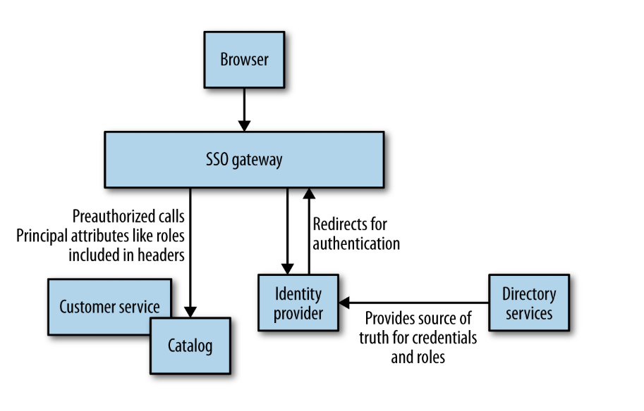
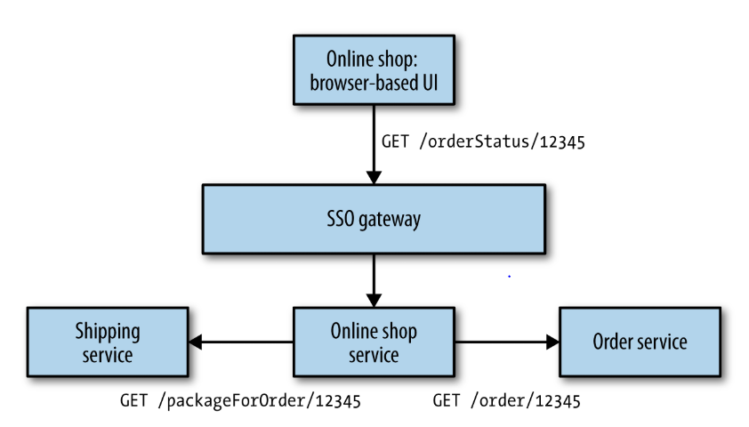

# Security

We need to be aware of the importance of customers' data in our systems. How can we work out what is *enough* security to protect that data?

## Authentication and Authorization

**Authentication** is the mechanism by which an actor proves that he is who he says he is. The actor who is being authenticated is called **principal**.

**Authorization** maps a principal to the action he's allowed to do.

Generally, in monolithic applications, web framework provide all the authentication and authorization functionalities for you. While in distributed systems we aim to authenticate a principal a single time for all microservices.

## Single Sign-On

SSO is a common approach to authentication and authorization.

*How it works:*

When a *principal* tries to access a *resource*, she is directed to authenticate with an *identity provider* that may ask her to provide a *secret*. If the identity provider is satisfied of the secret, it gives information to the service provider, allowing it to decide whether to grant her access to the resource.

The identity provider can be an external (e.g. Google's OpenID Connect service) or internal (common for enterprise platforms).

Common SSO implementations:

- [SAML](https://en.wikipedia.org/wiki/Security_Assertion_Markup_Language) (SOAP-based standard)
- [OpenID Connect](https://en.wikipedia.org/wiki/OpenID_Connect) (authentication layer on top of OAuth 2.0)

### Single Sign-On Gateway

Rather than having each microservice communicate with the identity provider, you could add a SSO Gateway to your system:

Information about principals can be passed to downstream microservices with HTTP headers.

Benefits:

- Drastically reduces network usage in your system.
- Can be used to terminate HTTPS at this level, run intrusion detection and so on.

Downsides:

- You need to make sure that developers are able to launch microservices behind a SSO gateway to test the system without too much effort.
- Could give a false sense of security.

A gateway may be able to provide fairly effective coarse-grained authorization using *roles*. Always prefer coarse over fine-grained authorization. The latter make your system hard to manage and reason about because business rules end up in the identity provider. Instead, these rules should be owned by your microservices.

## Service-to-Service Authentication and Authorization

When talking about programs authenticating with each other, we have several possibilities.

### Allow Everything Inside the Perimeter

Authentication is placed only at the perimeter of the system. Depending on the sensitivity of the data, this approach could be fine.

Benefits:

- Very easy to implement.

Downsides:

- Should an attacker penetrate the *perimeter*, you'll end up with major troubles. This can be mitigated by using HTTPS but still the stakes are high.

### HTTP(S) Basic Authentication

HTTP Basic Authentication allows for a client to send username and password in a standard HTTP header. This should normally be used with HTTPS to securely send credentials.

Benefits:

- Well understood and supported standard.

Downsides:

- You need to manage SSL certificates for your microservices.
- The overhead of HTTPS traffic can place additional strain on servers.
- SSL encrypted traffic can usually be cached only at service level.
- You need to manage user and passwords, either by syncing with an existing identity provider or independently (could cause functionality duplication).

### Reuse a SSO implementation

If you already have a SSO gateway implemented, you could reuse it for service-to-service authentication. Microservices should have their own *service accounts* to authenticate with each other.

Benefits:

- Reuses existing infrastructure.
- With each microservice having its own credentials, it's easy to revoke/restore them if they get compromised.

Downsides:

- You need to write code that supports the SSO implementation of your choice.
- You need to securely store the service accounts' credentials.

### Client certificates

Clients can install their own TLS certificates to authenticate to servers. This could be a mandatory choice if your service-to-service traffic goes through networks you don't control (e.g. Internet).

Benefits:

- Servers have strong guarantee that they're communicating with the right client.

Downsides:

- Even more difficult than managing only server certificates.

### HMAC over HTTP

An alternative approach is to use a [hash-based messaging code (HMAC)](https://en.wikipedia.org/wiki/HMAC) to sign the request with a hash computed from the request's body and a private key.

Benefits:

- Prevents MITM attacks.
- Traffic can be cached more easily than HTTPS traffic.
- Usually the overhead of generating hashes is lower than the one caused by HTTPS.

Downsides:

- You need a way to share the secret key.
- Hard to revoke the private key in case it's compromised.
- It's a pattern, not a standard, so there are divergent ways to implement it.
- Traffic is not encrypted.

### API Keys

API keys allow a service to identify who is making a call, and place limits on what they can do.

Benefits:

- Easy to use for service-to-service authentication.

Downsides:

- You need an API keys manager. Still, there are a lot of available tools.

## The deputy problem

Having a principal authenticate with a given microservice is simple. But what happens if that service then needs to call more services to complete an operation?

Without countermeasures, users can potentially trick the system into making calls to microservices that retrieve information they're not allowed to access (e.g. other users' data).

There is no simple answer to this problem. Depending on the sensitivity of the operation, you have different choices:

- Use an implicit trust model inside the microservices perimeter.
- Verify the identity of the caller before accepting a request (this could add duplicate logic in your microservices).
- Ask the caller to provide the credentials of the original principal.

## Securing Data at Rest

It's important to carefully store data at rest to limit the damage if an attacker obtains access to it.c Some principles to observe:

- Use existing implementations of cryptographic algorithms.
- Be careful how you manage your keys.
- Identify sensitive data that should be encrypted and data that can be shown in logs.
- Encrypt data when you first see it. Only decrypt it on demand.
- Encrypt backups.

## Other protections

There are other protective measures that you can apply to your system:

- Firewall.
- Logging (but be careful of what you log!).
- Intrusion detection systems.
- Network segregation (e.g. put separate microservices in separate networks).

Best practices:

- Keep your software updated and look out for new vulnerabilities.
- Give the service user on the server OS as few permissions as possible.
- Be frugal: collect only the data you need.

## The Human Element

You may also need policies to deal with the human element in your organization:

- How do you revoke access to credentials when someone leaves the organization?
- How can you protect yourself against social engineering?

## Baking Security In

Helping educate developers about security concerns is key. Also, you can integrate automated vulnerabilities probing tools in your CI build.

But when in doubt, reach out to an expert for a thorough check of your system.

## Summary

Having a system decomposed into finer-grained services gives us many more options as to how to solve a problem. This concept applies to security too. So, while we have additional problems to solve (e.g. the deputy problem), we can apply a mix of known solutions to solve these problems.