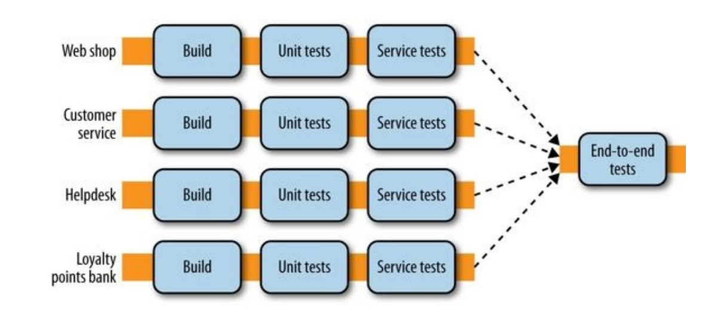

# Testing

Distributed systems add complexity in automated tests too.

## Types of Tests

Tests can be categorized by the following diagram:

In microservices, the amount of manual tests should be kept at a minimum in order to reduce test times. Also, since there are no significant difference in manual testing, we will examine how automated testing changes from monolithic systems to microservices systems.

## Test scope

The Test Pyramid is a model proposed by Mike Cohn to associate the ideal amount of tests to each test scope.

Note that terms like *service* and *unit* in this context are ambiguous and we will refer to the *UI* layer as *end-to-end* tests.

As we go up the pyramid our confidence increases but we reduce the ability to pinpoint bug causes and have a slower feedback.

Ideally, you want test of **different scopes for different purposes** (e.g. you can catch an integration bug with an e2e test and then you can keep it covered with a unit test).

How many tests? It's better to increase the number of tests as you go down the pyramid. Doing the opposite has the potential to keep your build *red* for long times.

### Unit Tests

They typically test a single function or method call in isolation (i.e. without starting services or using external resources such as network connectivity).

Done right, they can be very fast. You could run a lot of them in less than a minute.

These are *technology-facing* tests that will help us catch the most bugs and guide us through code restructuring thanks to their fast feedback and reliability.

Unit tests are also more easier to be implemented than other tests.

### Service Tests

They are designed to bypass the user interface and test services directly.

In monolithic systems, a group of classes that provide a certain service to users can be tested together.

In microservices, we need to isolate the service we want to test so that we are able to quickly find the root cause of a bug. To achieve this isolation, we need to stub out other services interacting with the one under test.
But note that while a **stubbed service** does not care if it's called 1 or 100 times, a **mocked service** can provide you with that information so you could write more solid tests. The downside is that mocked services can make your tests brittle because of the magnitude of details tested.

So after our service tests pass we are confident that the new microservice is ready to contact other microservices with no errors. But what about other microservices calling the one we want to deploy?

### End-to-End Tests

They are run against the whole system, so they cover a lot of code and give you a lot of confidence that the system will work in production.
On the other hand, it's harder to diagnose and issue that comes up in e2e tests.

These tests are tricky to deal with, suppose we add them at the end of our deploy pipeline:

Then we have 2 issues:

1. Which services version are we going to use in our tests?
2. Executing such a pipeline for each microservice is going to be really inefficient.

Both of them are solved with a *fan in* model:

But there are other disadvantages when using e2e tests:

- As the scope increases, we might face more errors due to **causes unrelated to the behavior we want to test** (e.g. network failures).
- When tests fail *sometimes* because of unrelated issues (these are called **flaky tests**), people will tend to re-run them without any effort to understand the errors. This will cause lots of scheduled builds and lead to a broken system because some issues (e.g. concurrency issues) may slip through this process as unrelated issues. Flaky tests will also cause a [normalization of deviance](https://en.wikibooks.org/wiki/Professionalism/Diane_Vaughan_and_the_normalization_of_deviance) in the test system, so it's mandatory to remove them (or temporarily disable them to apply a fix) as soon as they're spotted.

## Who Writes These Tests?